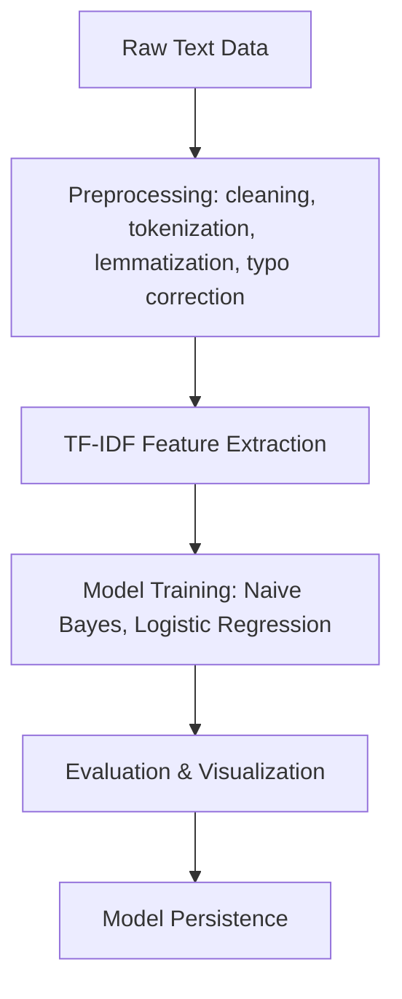
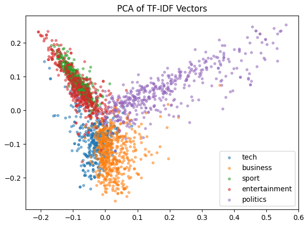
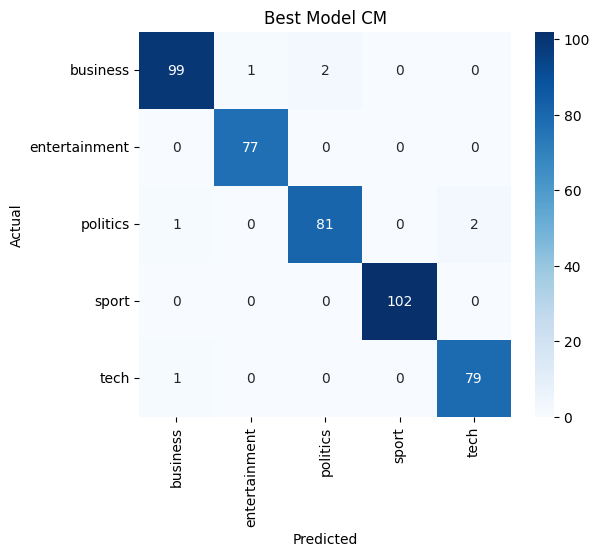

# News Article Categorization and Analysis

A professional NLP pipeline for classifying BBC news articles into five categories: business, entertainment, politics, sport, and tech. The project demonstrates advanced preprocessing, typo correction, feature extraction, model training, evaluation, and visualization.

---

## Pipeline Overview



---

## Installation

1. Clone or download this repository.
2. Create and activate a Python virtual environment:
   ```sh
   python -m venv .venv
   .venv\Scripts\Activate.ps1   # (Windows PowerShell)
   ```
3. Install dependencies:
   ```sh
   pip install -r requirements.txt
   ```

---

## Usage

1. Launch JupyterLab or Notebook:
   ```sh
   jupyter lab
   ```
2. Open `news_article_classification.ipynb` and run all cells in order.
3. If you see widget/progress-bar errors, enable ipywidgets:
   ```sh
   pip install ipywidgets
   jupyter nbextension enable --py widgetsnbextension
   ```

---

## Results

### PCA of TF-IDF Vectors


### Confusion Matrix


---

## Dependencies

- pandas==2.2.3           # data loading & manipulation
- numpy==2.2.6            # numerical operations
- scikit-learn==1.6.1     # feature extraction & modeling
- nltk==3.9.1             # tokenization & lemmatization
- rapidfuzz==3.13.0       # typo correction
- tqdm==4.67.1            # progress bars
- matplotlib==3.10.3      # plotting
- seaborn==0.13.2         # statistical visualization
- joblib==1.5.1           # model persistence
- ipywidgets==8.1.7       # interactive widgets
- ipykernel==6.29.5       # Jupyter kernel support

---

## Project Structure

```
NLP_PROJECT_FINAL/
├── bbc-text.csv
├── news_article_classification.ipynb
├── requirements.txt
├── README.md
├── pca_plot.png
├── confusion_matrix.png
└── (saved models, etc.)
```

---

**Tip:**
Export the PCA and confusion matrix plots from your notebook as PNG files and place them in the project root for the images to display in the README.


